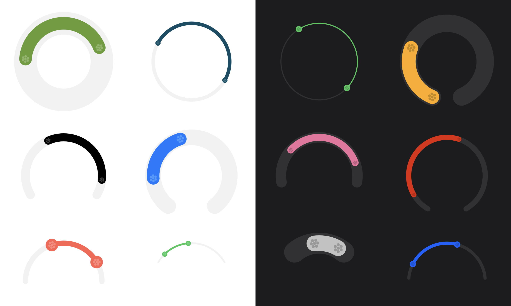
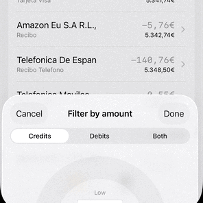

# Circular Range Slider



<p>
<a href="https://swiftpackageindex.com/diegotid/circular-range-slider"></a>


<a href="LICENSE"></a>
</p>

## Overview

**Circular Range Slider** is a customizable SwiftUI component for selecting a range of values using a circular slider. It is designed for modern iOS apps and supports full customization of appearance and behavior.


## Features

- Circular range selection with two handles
- Customizable colors, size, arc, and step
- Haptic feedback
- SwiftUI native
- iOS 17+ support

## Requirements

- iOS 17.0+
- Swift 5.9+


## Installation

### Swift Package Manager (Xcode)

1. In Xcode, open your project.
2. Go to **File > Add Packages...**
3. Enter the URL:
	```
	https://github.com/diegotid/circular-range-slider.git
	```
4. Select the version and add the package to your app target.

Then import the module where you want to use it:

```swift
import CircularRangeSlider
```

## Usage

```swift
@State private var range: ClosedRange<Double> = 10...50

var body: some View {
	CircularRangeSlider(
		range: $range,
		bounds: 0...100
	)
}
```

### Customization

You can customize the appearance and behavior:

```swift
CircularRangeSlider(
	range: $range,
	bounds: 0...100,
	circleDiameter: 220,
	arcTrimmingDegrees: 75,
	trackWidth: 45,
	handleWidth: 36,
	color: .accentColor,
	step: 5
)
```

### Preview

This package includes a SwiftUI preview for the circular range slider, allowing you to see and interact with the component directly in Xcode's canvas.

#### How to use the preview in Xcode

1. Open `CircularRangeSlider.swift` in Xcode.
2. Make sure the canvas is visible (toggle with `Option + Command + Return` if needed).
3. Click the "Resume" or "Play" button at the top right of the canvas to build and display the live preview.
4. You can interact with the preview to test the slider's features and customization options.

If you don't see the preview, ensure you are running Xcode 15 or later and your target platform is set to iOS 17 or above.

## Sample Project

Below is a demonstration of the Circular Range Slider in action within a personal banking iOS app. In this example, the slider is used to filter transactions by both date range and amount range, providing users with an intuitive and interactive way to refine their search results.



This showcases how the component can be seamlessly integrated into real-world applications to enhance user experience.

### Demo's code

The view showcased above is initiated as follows:

```swift
import SwiftUI
import CircularRangeSlider

struct TransactionFilterControl: View {
    var filtering: TransactionFilter
    var bounds: TransactionListBounds
    
    @Binding var filter: TransactionListBounds
    
    @State private var rangeUserSelection: ClosedRange<Double>?
    @State private var boundsUserSelection: ClosedRange<Double>?
    @State private var transactionType: TransactionType
    @State private var datePickerToggle: Bool
    @State private var isLately: Bool
    @State private var latelyTerm: LatelyTerm

    init(filtering: TransactionFilter,
         bounds: TransactionListBounds,
         filter: Binding<TransactionListBounds>) {
        self.filtering = filtering
        self.bounds = bounds
        self._filter = filter
        self.transactionType = .anything
        self.datePickerToggle = false
        self.isLately = false
        self.latelyTerm = .month
    }
```

Then, the circular range slider is added to the view hierarchy:

```swift
	if let userRange = rangeUserSelection,
		let userBounds = boundsUserSelection {
		ZStack {
			CircularRangeSlider(
				range: Binding(
					get: { userRange },
					set: { self.rangeUserSelection = $0 }
				),
				bounds: userBounds
			)
			switch filtering {
			case .dates: dateRangeDisplay()
			case .amounts: amountRangeDisplay()
			case .none: EmptyView()
			}
		}
		.padding(.bottom, -16)
	}
	Spacer()
```

...and the selected values are overlayed on top of the slider with the following views:

```swift
    @ViewBuilder
    private func dateRangeDisplay() -> some View {
        VStack(alignment: .center) {
            if isLately,
               let dates = filter.dates {
                HStack {
                    dateVertical(dates.lowerBound)
                        .frame(maxWidth: .infinity)
                    Text("⇢")
                        .padding(.top, 18)
                    dateVertical(dates.upperBound)
                        .frame(maxWidth: .infinity)
                }
                .padding(.bottom, -8)
                Text("In the last")
                    .font(.caption)
                    .foregroundColor(.secondary)
                    .padding(.top, 6)
                    .padding(.bottom, -12)
                Picker("Lately term", selection: $latelyTerm) {
                    ForEach(LatelyTerm.allCases) { option in
                        Text(option.rawValue).tag(option)
                    }
                }
                .pickerStyle(.menu)
                .padding(.leading, 8)
                .padding(.bottom, -12)
            } else if let dates = isLately ? last(days: latelyTerm.days) : bounds.dates,
                      let _ = filter.dates {
                HStack {
                    datePicker(bounds: dates, end: .low)
                        .frame(maxWidth: .infinity)
                    Text("⇢")
                        .padding(.bottom, 14)
                    datePicker(bounds: dates, end: .high)
                        .frame(maxWidth: .infinity)
                }
                .padding(.bottom, 6)
            }
        }
        .padding(.top, 18)
        .frame(maxWidth: 120)
    }
    
    @ViewBuilder
    private func amountRangeDisplay() -> some View {
        VStack(alignment: .center) {
            Text("Low")
                .font(.caption)
                .foregroundColor(.secondary)
            if let amounts = bounds.amounts,
               let _ = filter.amounts {
                amountInput(bounds: amounts, end: .low)
                amountInput(bounds: amounts, end: .high)
            }
            Text("High")
                .font(.caption)
                .foregroundColor(.secondary)
                .padding(.top, .leastNonzeroMagnitude)
        }
        .frame(maxWidth: 120)
    }
```

## License

This project is licensed under the GPL License. See [LICENSE](LICENSE) for details.

## Credits

Created by Diego Rivera.